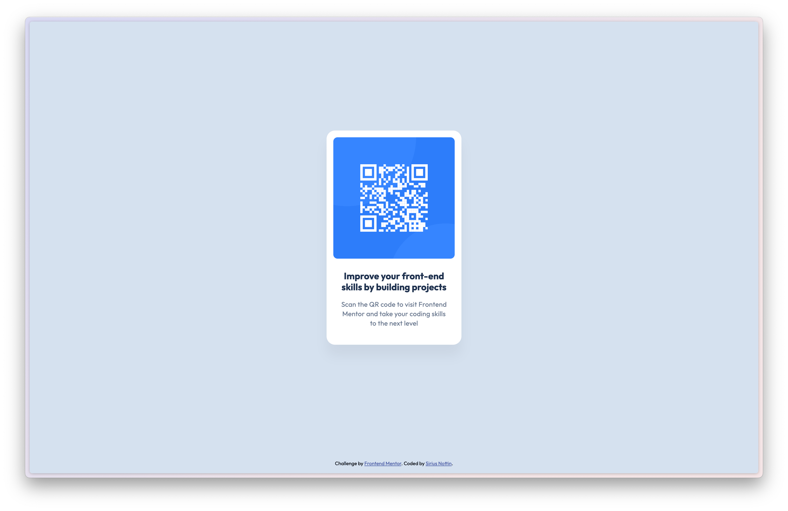

# Frontend Mentor - QR code component solution

This is a solution to the [QR code component challenge on Frontend Mentor](https://www.frontendmentor.io/challenges/qr-code-component-iux_sIO_H). Frontend Mentor challenges help you improve your coding skills by building realistic projects. 

## Table of contents

- [Frontend Mentor - QR code component solution](#frontend-mentor---qr-code-component-solution)
  - [Table of contents](#table-of-contents)
  - [Overview](#overview)
    - [Screenshot](#screenshot)
    - [Links](#links)
  - [My process](#my-process)
    - [Built with](#built-with)
    - [What I learned](#what-i-learned)
    - [Continued development](#continued-development)
  - [Author](#author)
  - [Acknowledgments](#acknowledgments)

## Overview

### Screenshot

### Links

- Solution URL: [github.com/siriusnottin/qr-code-component](https://github.com/siriusnottin/qr-code-component)
- Live Site URL: [siriusnottin.github.io/qr-code-component/](https://siriusnottin.github.io/qr-code-component/)

## My process

### Built with

- Semantic HTML5 markup
- CSS variables
- Flexbox
- CSS Grid

### What I learned

* How to right semantic HTML, use of CSS variables, nested CSS rules, work on a real project with a  provided Figma design file.

### Continued development

I'll keep on working on similar projects, focusing on writting good semantic HTML tags, and try to improve my CSS skills.

## Author

- Website - [Sirius Nottin](https://nottin.me)
- Frontend Mentor - [@siriusnottin](https://www.frontendmentor.io/profile/siriusnottin)
- X.com (Twitter) - [@siriusnottin](https://www.x.com/siriusnottin)
- LinkedIn - [@siriusnottin](https://www.linkedin.com/in/siriusnottin)

## Acknowledgments

Thanks to [Katy_v4](https://www.twitch.tv/katy_v4)'s community, particularly the [Brief of the Week](https://briefweek.fr/) challenge, which was originally launched on her [Discord community](https://discord.gg/NUFFgHC3xs), that I started last week. It helped me a lot to get through my imposter's syndrome, and allowed me to work on real projects with real deadlines.
